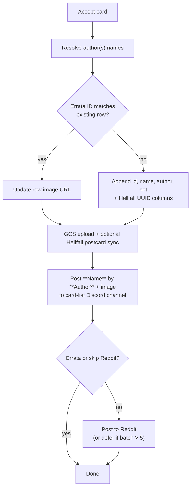
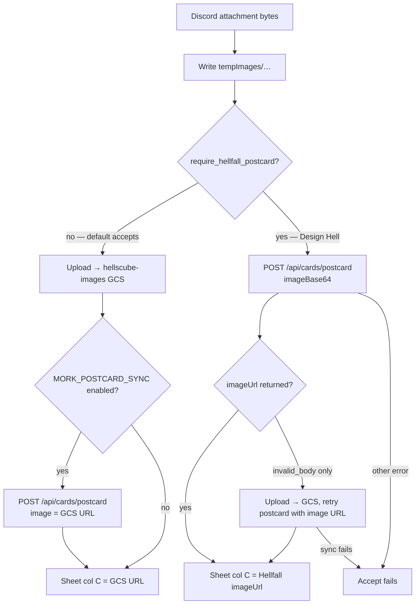

# Acceptance

[← Card flows](README.md)

## accept_card (persistence)

Called from compile-veto, graveyard fast-track, instaerrata, sneak accept, design hell, and errata flows.

**Defaults:** set `SOH`, card list `SOH_CARD_LIST`  
**Design Hell:** mandatory Hellfall postcard sync

---

## IMG step (image upload + Hellfall sync)

Runs after the sheet row is resolved (new append or errata update). Implemented in `acceptCard.py` → `_resolve_accepted_image_url`.

### Input

Callers download the Discord attachment **before** `accept_card` — the pipeline never uses a Discord CDN URL directly.

| Caller                                               | How bytes arrive                |
| ---------------------------------------------------- | ------------------------------- |
| compile-veto, instaerrata, sneak accept, Design Hell | `await attachment.to_file()`    |
| graveyard fast-track                                 | `attachment.read()` → `BytesIO` |

Inside `accept_card`, bytes are written to `tempImages/{cardName}{ext}` (slashes in the name become `|`) and kept for Reddit posting until the end of the flow.

### Sub-flow

### GCS upload

| Setting             | Value                                                                          |
| ------------------- | ------------------------------------------------------------------------------ |
| Bucket              | `hellscube-images` (`GCS_CARD_IMAGE_BUCKET`)                                   |
| Credentials         | `GOOGLE_APPLICATION_CREDENTIALS` (default `./bot_secrets/client_secrets.json`) |
| Object key (new)    | `{slug(hcid or cardName)}{ext}` — non-alphanumeric chars → `_`, max 180 chars  |
| Object key (errata) | **Overwrite** existing object if sheet col C already points at the same bucket |
| Public URL          | `https://storage.googleapis.com/hellscube-images/…`                            |

Card images go to GCS only — never Google Drive.

### Hellfall postcard sync

Optional for most accepts; **mandatory** for Design Hell (`require_hellfall_postcard=True`).

| Env var                     | Role                                                                                                     |
| --------------------------- | -------------------------------------------------------------------------------------------------------- |
| `MORK_POSTCARD_SYNC`        | Default `"1"`. Set to `0` / `false` / `no` / `off` to skip optional sync. Ignored when sync is required. |
| `HELLFALL_API_URL`          | API base (required when sync runs)                                                                       |
| `HELLFALL_POSTCARD_API_KEY` | Bearer token                                                                                             |

**Endpoint:** `POST {HELLFALL_API_URL}/api/cards/postcard`

Payload includes `name`, `creators`, `set`, `kind: "card"`, and either `imageBase64` or `image` (URL). Errata and new cards both send `hcid` (existing id or next numeric id).

**Response used:** `imageUrl`, `id` (Hellfall UUID → sheet col BB), `oracle_id` (→ col BC). On new cards only, UUID columns are written when sync succeeds.

**Failure:** If anything after a successful postcard write throws, `POST …/postcard/rollback` runs before the error propagates. Design Hell aborts acceptance entirely if sync does not complete.

### Default vs Design Hell

|                    | Default (compile-veto, errata, sneak, graveyard, …) | Design Hell                                                  |
| ------------------ | --------------------------------------------------- | ------------------------------------------------------------ |
| Order              | GCS first, then optional Hellfall                   | Hellfall first (base64), GCS fallback on `invalid_body` only |
| Sync required?     | No — gated by `MORK_POSTCARD_SYNC`                  | Yes — `require_sync=True`                                    |
| URL in sheet col C | GCS URL (Hellfall `imageUrl` not substituted)       | Hellfall `imageUrl`, or GCS URL if Hellfall omits it         |

### Errata vs new card (image)

|                    | New card                           | Errata                                |
| ------------------ | ---------------------------------- | ------------------------------------- |
| `hcid` to Hellfall | Next numeric id                    | Existing `errataId`                   |
| GCS object         | New key from slug                  | Overwrite if col C URL is same bucket |
| Sheet write        | Cols A, B, C, D, E + BB/BC on sync | **Col C only** (image URL)            |
| Reddit             | Posted (unless batch deferred)     | Skipped                               |
