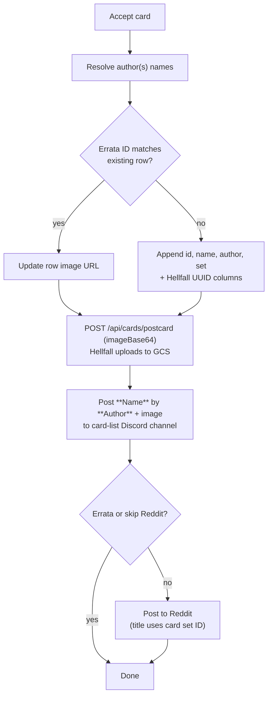
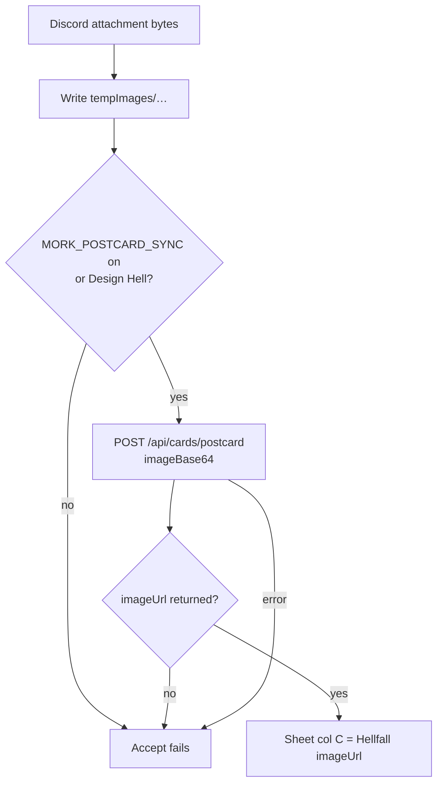

# Acceptance

[← Card flows](README.md)

## accept_card (persistence)

Called from compile-veto, graveyard fast-track, instaerrata, sneak accept, design hell, and errata flows.

**Defaults:** set `SOH`, card list `SOH_CARD_LIST`  
**Design Hell:** mandatory Hellfall postcard sync

**Reddit title:** `post_to_reddit` builds `"… was accepted into {set_id}"` (or `"… was vetoed from {set_id}"`) from the card's set — not `CUBE_NAME`. Design Hell gold uses the pinned set (e.g. `SCL.X`); compile-veto accepts use `SOH`.

**Deferred overflow** (`deferred_reddit/` when batch > 5): manifest stores one JSON object per line (`filename`, `card_message`, `set_id`, `was_vetoed`) so Unicode, tabs, and quotes in card names round-trip safely. Older tab-separated manifests still parse.

---

## IMG step (image upload + Hellfall sync)

Runs after the sheet row is resolved (new append or errata update). Implemented in `acceptCard.py` → `_resolve_accepted_image_url`.

### Input

Callers download the Discord attachment **before** `accept_card` — the pipeline never uses a Discord CDN URL directly.

| Caller                                               | How bytes arrive                |
| ---------------------------------------------------- | ------------------------------- |
| compile-veto, instaerrata, sneak accept, Design Hell | `await attachment.to_file()`    |
| graveyard fast-track                                 | `attachment.read()` → `BytesIO` |

Inside `accept_card`, bytes are written to `tempImages/{cardName}{ext}` (slashes in the name become `|`) and kept for Reddit posting until the end of the flow.

### Sub-flow

### Image storage

Mork does **not** upload card or token images to GCS or Drive. Hellfall receives `imageBase64` via the postcard API, uploads to `hellscube-images` server-side, and returns `imageUrl`.

### Hellfall postcard sync

Optional for most accepts; **mandatory** for Design Hell (`require_hellfall_postcard=True`).

| Env var                     | Role                                                                                                     |
| --------------------------- | -------------------------------------------------------------------------------------------------------- |
| `MORK_POSTCARD_SYNC`        | Default `"1"`. Set to `0` / `false` / `no` / `off` to skip optional sync. Ignored when sync is required. |
| `HELLFALL_API_URL`          | API base (required when sync runs)                                                                       |
| `HELLFALL_POSTCARD_API_KEY` | Bearer token                                                                                             |

**Endpoint:** `POST {HELLFALL_API_URL}/api/cards/postcard`

Payload includes `name`, `creators`, `set`, `kind: "card"`, and `imageBase64`. Errata and new cards both send `hcid` (existing id or next numeric id).

**Response used:** `imageUrl`, `id` (Hellfall UUID → sheet col BB), `oracle_id` (→ col BC). On new cards only, UUID columns are written when sync succeeds.

**Failure:** If anything after a successful postcard write throws, `POST …/postcard/rollback` runs before the error propagates. Design Hell aborts acceptance entirely if sync does not complete.

### Default vs Design Hell

|                    | New card / errata (`MORK_POSTCARD_SYNC` on) | Design Hell                              |
| ------------------ | ------------------------------------------- | ---------------------------------------- |
| Image path         | `imageBase64` → Hellfall uploads to GCS     | Same                                     |
| Sync required?     | No — gated by `MORK_POSTCARD_SYNC`          | Yes — `require_sync=True`                |
| URL in sheet col C | Hellfall `imageUrl`                         | Hellfall `imageUrl`                      |

### Errata vs new card (image)

|                    | New card                           | Errata                                |
| ------------------ | ---------------------------------- | ------------------------------------- |
| `hcid` to Hellfall | Next numeric id                    | Existing `errataId`                   |
| Image upload       | Hellfall via `imageBase64`         | Hellfall via `imageBase64`            |
| Sheet write        | Cols A, B, C, D, E + BB/BC on sync | **Col C only** (image URL)            |
| Reddit             | Posted (unless batch deferred)     | Skipped                               |
