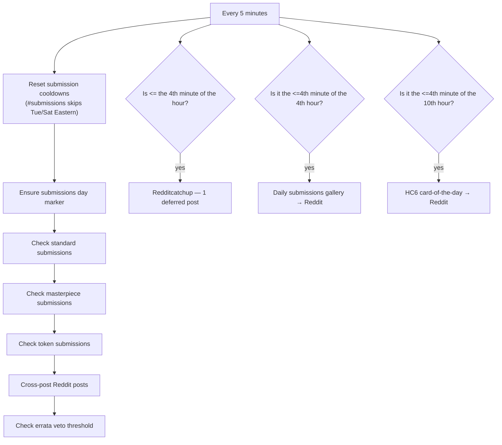
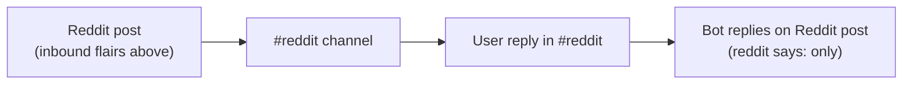
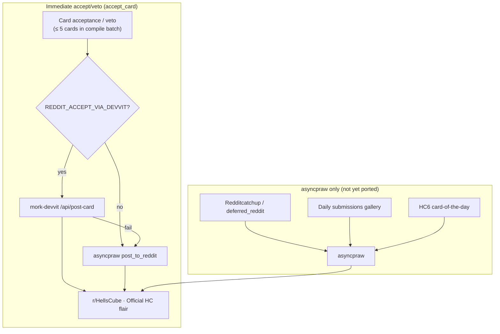
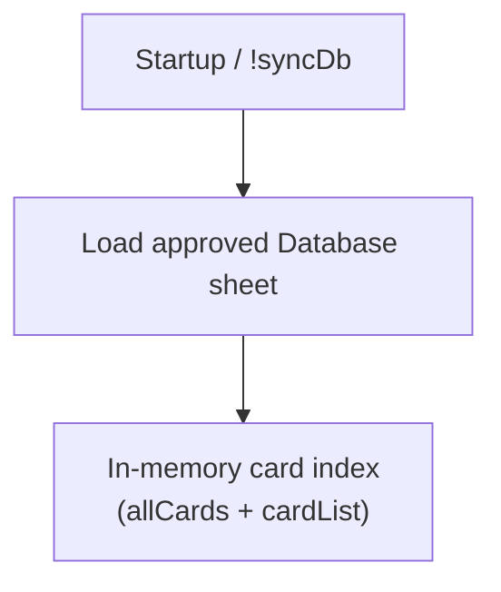
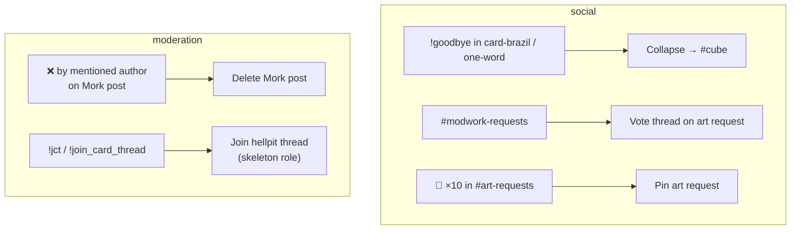

# Background & lookup

[← Card flows](README.md)

## Lifecycle cron loop

Runs every 5 minutes. No idea which timezone the instance runs on.

`reset_countdowns` keeps `#submissions` cooldown rows until 22 **open** hours have passed (Tuesday and Saturday in US Eastern do not count). Masterpiece cooldowns still use wall-clock hours.

---

## Reddit → Discord

Cron: `check_reddit` every 5 minutes (see lifecycle loop above).

**Inbound flairs** (posts matching any of these are cross-posted to `#reddit`):

| Flair                                          | Discord prefix                             |
| ---------------------------------------------- | ------------------------------------------ |
| Card Idea, HellsCube Submission, Brainstorming | `reddit says:`                             |
| Hellscube Would Love This (Shitpost)           | `Reddit thinks Hellscube would love this:` |

Reply bridge only fires when the prior Mork message starts with `reddit says:` — not the shitpost prefix.

---

## Discord → Reddit

**Outbound flair:** all posts use **Official HC** (`OFFICIAL_HC_REDDIT_FLAIR`). Accepted and vetoed cards share the same flair in code.

**Outbound titles:** card acceptance posts use the card's **set ID** in the title (e.g. `was accepted into SOH`, `was accepted into SCL.X`), not `CUBE_NAME`.

Stage 1 Devvit migration: **immediate acceptance/veto posts only** can route through `mork-devvit` when flagged. Everything else still uses asyncpraw.

| Outbound path | Transport | Image source |
| ------------- | --------- | ------------ |
| Immediate accept/veto | Devvit (optional) → asyncpraw fallback | Hellfall GCS URL or `tempImages/` |
| Deferred batch (`> 5` cards) | asyncpraw | `deferred_reddit/` files |
| Daily gallery | asyncpraw | Discord submission attachments |
| Card of the day | asyncpraw | HC6 sheet image URL → temp file |
| Discord → Reddit reply | asyncpraw | — |

---

## Database lookup & metadata

**Entry:** Bot startup · `!syncDb` (admin)

| Trigger                 | Reads                              | Writes                       |
| ----------------------- | ---------------------------------- | ---------------------------- |
| `!random`               | `allCards` → random image          | —                            |
| `!info`                 | `cardList` / ID lookup             | —                            |
| `!search`               | `cardList` via `searchFor`         | —                            |
| `!creator`              | `allCards` → creator               | —                            |
| `!rulings`              | `cardList` → rulings               | —                            |
| `{{card name}}` in chat | `allCards` via fuzzy match → image | —                            |
| `!judgement`            | exact name via `allCards`          | Unapproved · rulings (col 8) |
| `!tag` / `!removetag`   | exact name via `allCards`          | Unapproved · tags (col 22)   |

---

## Auxiliary card-adjacent flows

