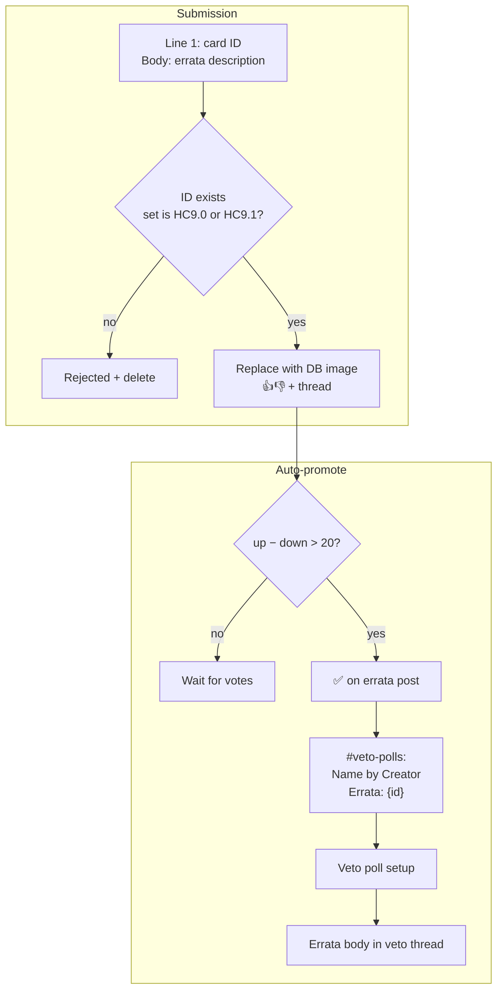
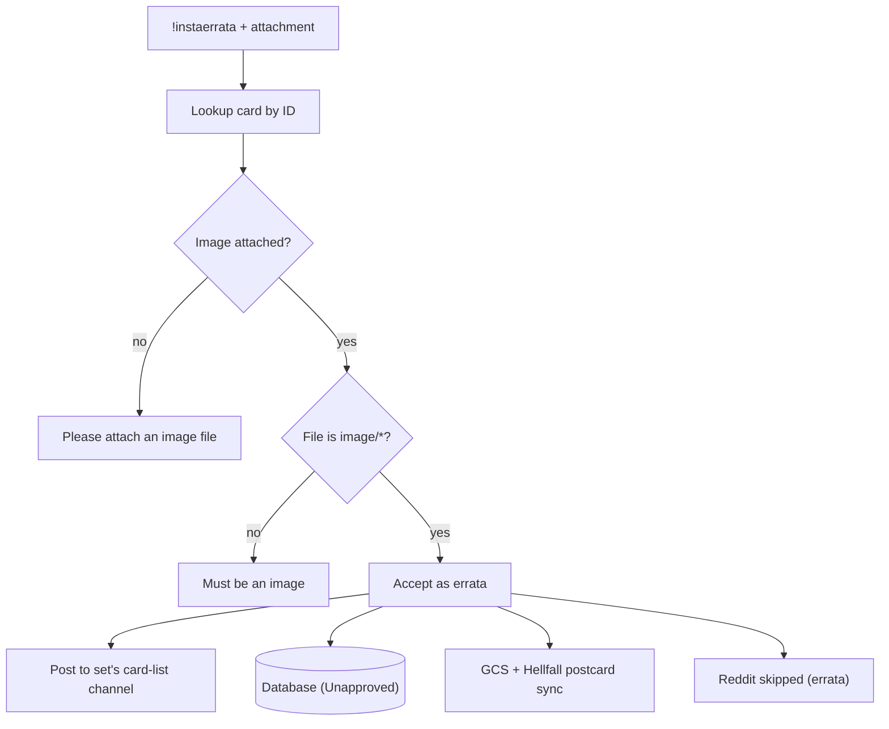

# Errata

[← Card flows](README.md)

## Errata submission (`#errata-submissions`)

**Entry:** `#errata-submissions` message handler · background auto-promote every 5 min



Auto-promote scans the last **14 days**, up to **200 messages**.

---

## Admin instant errata

**Entry:** `!instaerrata` (admin or instaerrata-review role) with attachment + text:

```
Cardname by Author
Errata: <card id>
```



---
