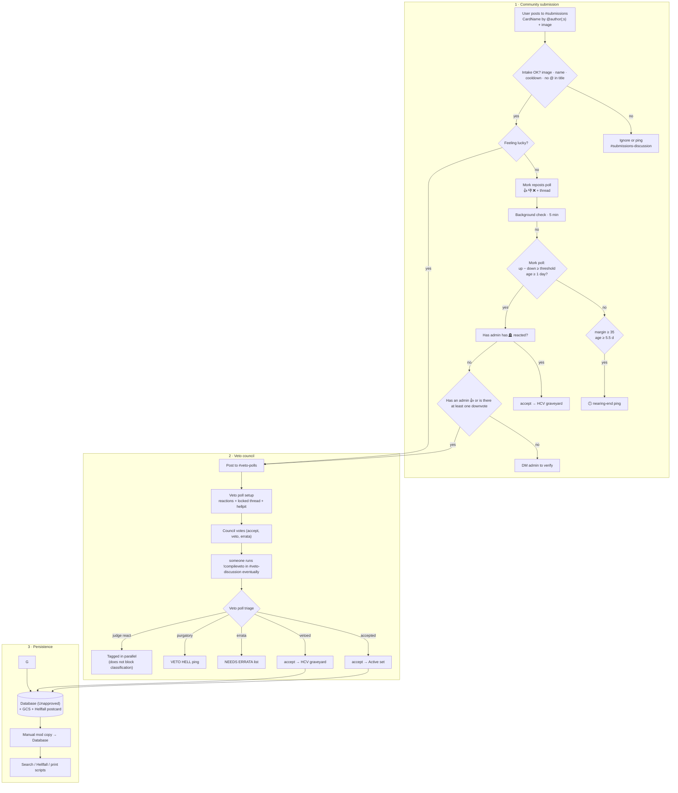

# Overview

[← Card flows](README.md)

## End-to-end lifecycle

```mermaid
flowchart TD
  subgraph submit["1 · Community submission"]
    A["User posts to #submissions<br/>CardName by @author(;s) + image"] --> IN{"Intake OK? image · name · cooldown · no @ in title"}
    IN -->|no| X["Ignore or ping<br/>#submissions-discussion"]
    IN -->|yes| MAG{"Feeling lucky?"}
    MAG -->|no| POLL["Mork reposts poll<br/>👍 👎 ❌ + thread"]
    POLL --> LOOP["Background check · 5 min"]
    LOOP -- no --> CHK{"Mork poll:<br/>up − down ≥ threshold<br/>age ≥ 1 day?"}
    CHK -- no --> REMINDER_CHECK{"margin ≥ 35<br/>age ≥ 5.5 d"}
    REMINDER_CHECK -- yes --> REM["🕛 nearing-end ping"]


    CHK -- yes --> GRAVE_CHECK["Has admin has 🪦 reacted?"]
    GRAVE_CHECK -- yes --> GRAVE_ACCEPT["accept → HCV graveyard"]
    GRAVE_CHECK -- no --> ADMIN_SAFEGUARD{"Has an admin 👍 or is there at least one downvote"}

    ADMIN_SAFEGUARD -- no --> ADM["DM admin to verify"]
  end

  MAG -->|yes| VETO_FLOW
  ADMIN_SAFEGUARD -->|yes| VETO_FLOW

  subgraph veto["2 · Veto council"]
    VETO_FLOW["Post to #veto-polls"] --> H["Veto poll setup<br/>reactions + locked thread + hellpit"]
    H --> I["Council votes (accept, veto, errata)"]
    I --> J["someone runs !compileveto in #veto-discussion eventually"]
    J --> K{"Veto poll triage"}
    K -->|accepted| L["accept → Active set"]
    K -->|vetoed| M["accept → HCV graveyard"]
    K -->|errata| N["NEEDS ERRATA list"]
    K -->|purgatory| O["VETO HELL ping"]
    K -->|judge react| P["Tagged in parallel<br/>(does not block classification)"]
  end

  subgraph persist["3 · Persistence"]
    L --> Q[("Database (Unapproved)<br/>+ GCS + Hellfall postcard")]
    M --> Q
    G --> Q
    Q --> R["Manual mod copy → Database"]
    R --> S["Search / Hellfall / print scripts"]
  end
```
