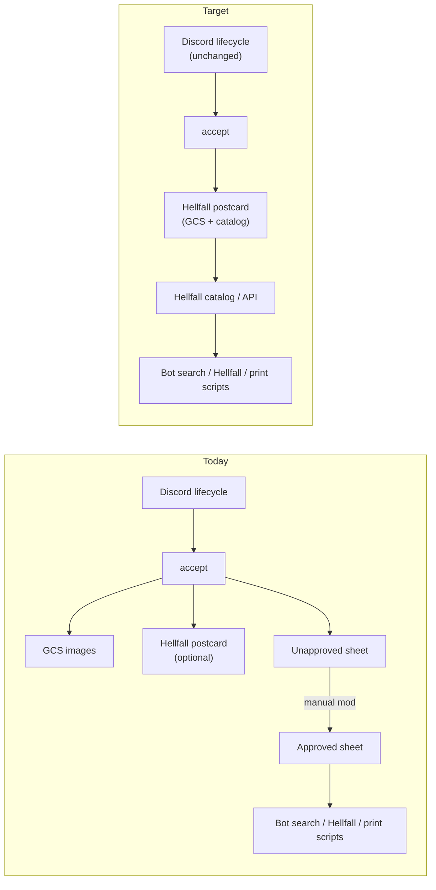
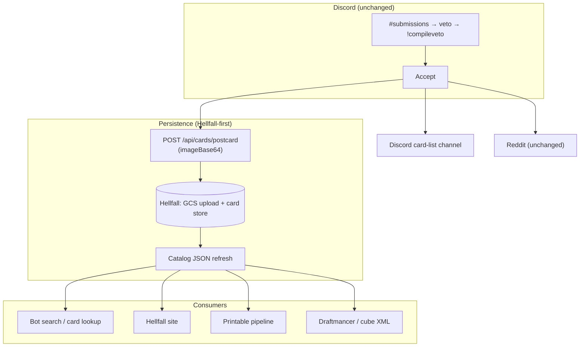
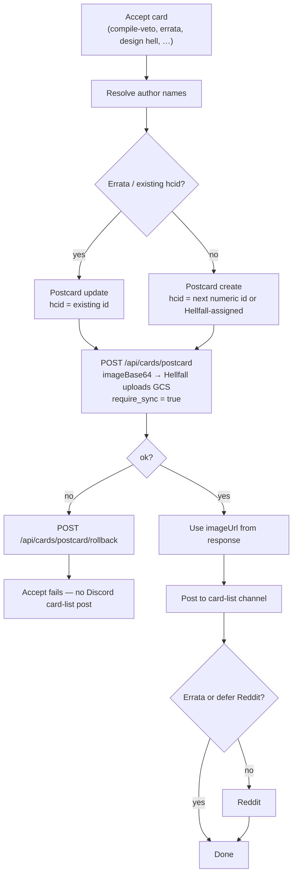
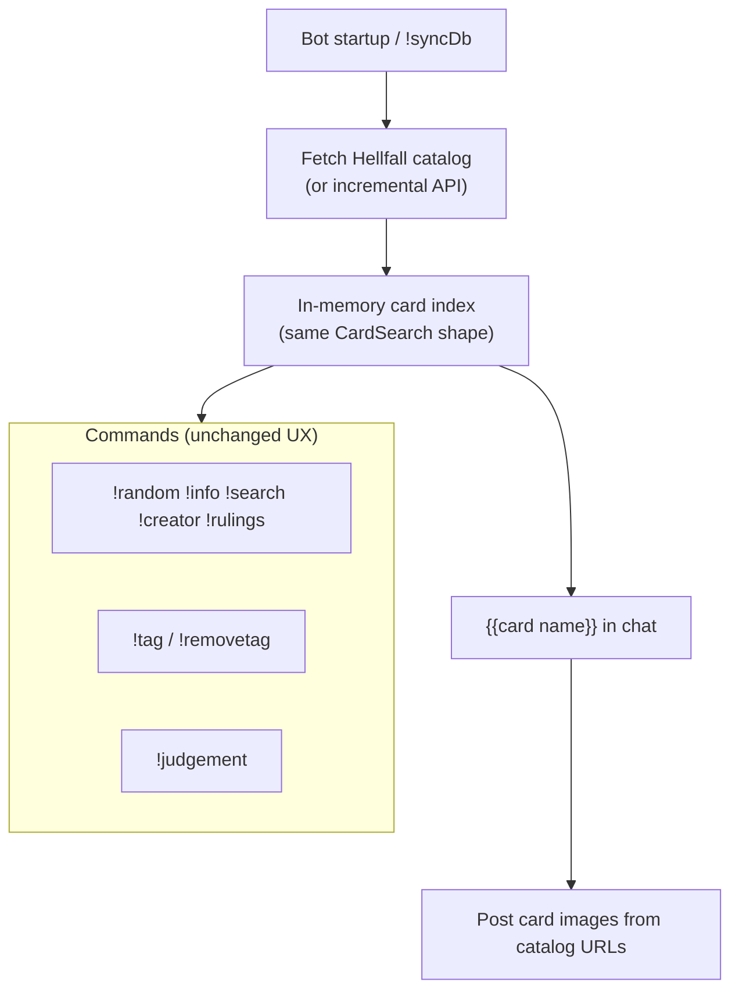
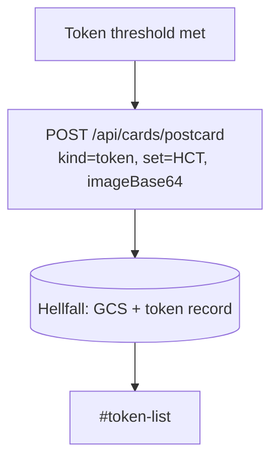
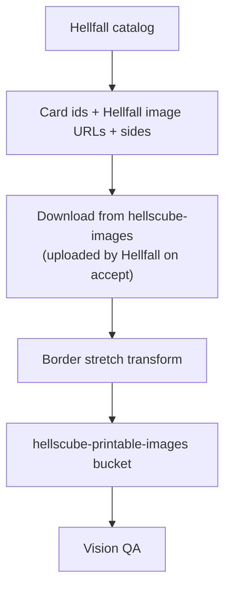
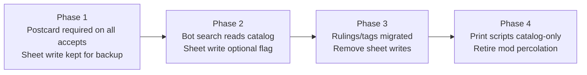

# Post–Google Sheets (target)

[← Card flows](README.md)

Target architecture once card data lives in **Hellfall** (via postcard API + catalog) instead of Google Sheets. Discord submission and veto flows stay the same; only the persistence and lookup layers change.

**Status:** acceptance uploads images via Hellfall postcard only (`imageBase64`); unapproved/approved sheets are still written and bot search still loads from the approved sheet.

---

## Current vs target

| Concern | Today | Target |
|---------|-------|--------|
| Card record on accept | Row on unapproved sheet | Hellfall document via postcard API |
| Image URL | Mork uploads GCS + copied to sheet col C | Hellfall uploads GCS via postcard; `imageUrl` from response |
| HC numeric id | Sheet col A (increment) | `hcid` passed to postcard; Hellfall assigns UUID |
| Bot `!search`, `!info`, etc. | Load approved **Database** sheet at startup | Load Hellfall catalog (or API) |
| Mod percolation | Manual sheet copy | **Removed** — postcard write is approval |
| Rulings / tags | Unapproved sheet columns | Hellfall fields or dedicated API (TBD) |
| Tokens | Unapproved token sheet + postcard | Postcard only |
| Printable pipeline | Reads Database / Printable DB sheets | Reads Hellfall catalog + GCS |
| Rollback on failed accept | Postcard rollback + no sheet commit if error mid-flight | Postcard rollback (Hellfall may revert GCS object); no sheet step |

---

## End-to-end lifecycle (target)

---

## Acceptance (target)

Replaces the current accept flow where sheet rows are the system of record.

**Design Hell** already sends `imageBase64` to Hellfall first — that becomes the default for all accepts. Mork stops calling GCS directly; Hellfall owns upload to `hellscube-images` and returns `imageUrl`.

**Errata:** lookup existing card by hcid in Hellfall, not sheet row; update image and metadata via postcard with same `hcid` (Hellfall overwrites the GCS object when applicable).

**No sheet write:** UUID / oracle_id from postcard response are stored in Hellfall only (not mirrored to sheet columns).

---

## Lookup & metadata (target)

**Open questions for implementation:**

- Rulings and tags: extend postcard API, separate Hellfall admin endpoints, or keep a thin metadata store
- Username mappings: today a sheet tab; move to config file or Hellfall creator normalization
- Errata submission validation: resolve card by hcid via catalog instead of approved sheet

---

## Token acceptance (target)

Token flow matches target: postcard required, Hellfall owns GCS upload via `imageBase64`.

---

## Printable pipeline (target)

Sheet-based Printable DB and Database column scans become optional backfill tools, not production path.

---

## Migration phases (suggested)

| Phase | Discord | Accept | Read path | Sheets |
|-------|---------|--------|-----------|--------|
| 1 (partial now) | unchanged | mork GCS + postcard; sheet still updated | approved sheet | source of truth for search |
| 2 | unchanged | postcard required; Hellfall GCS | catalog + sheet fallback | dual-write |
| 3 | unchanged | postcard only; Hellfall GCS | catalog | read-only / deprecated |
| 4 | unchanged | postcard only; Hellfall GCS | catalog | removed |

---

## What does not change

- Submission, veto, errata, and compile-veto **Discord** flows
- Reaction-driven state (no enum)
- Card-list channel posts and Reddit deferral
- Cooldown files and background submission checks
- Hellpit threads and veto poll triage logic

See [Overview](overview.md) for the current Discord lifecycle; this doc only replaces the persistence tail.
