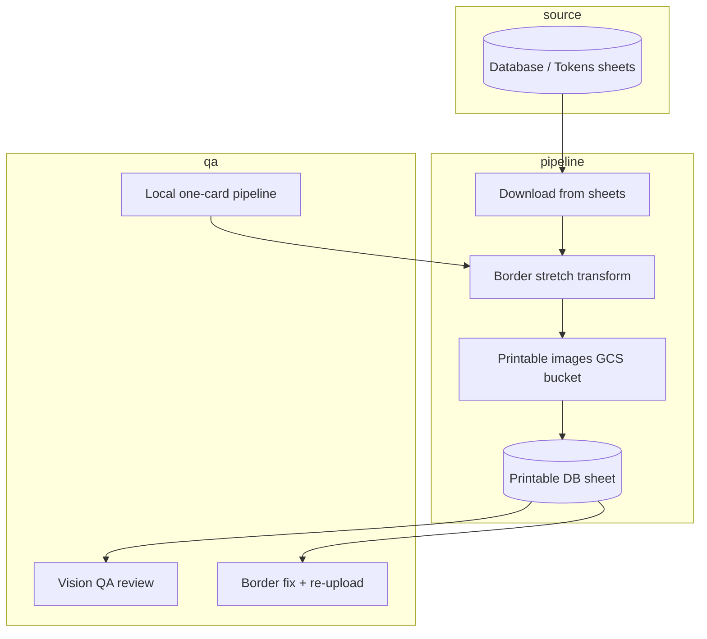
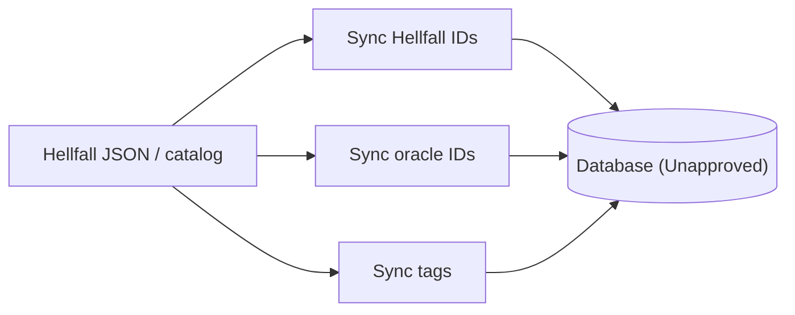
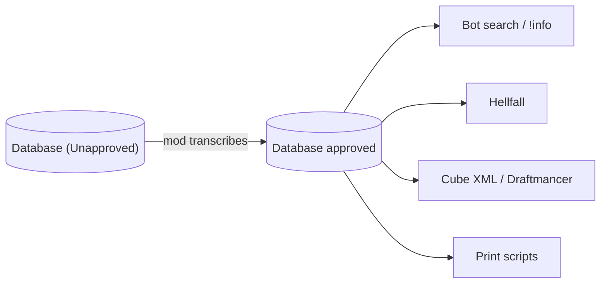

# Scripts & percolation

[← Card flows](README.md)

Misc card handling stuff, like the printabledb workflow

## Printable / printing pipeline

---

## Hellfall / catalog sync

Card acceptance also writes Hellfall UUID and oracle_id on accept via postcard sync.

---

## Manual mod percolation

No bot automation — mods transcribe by hand.

