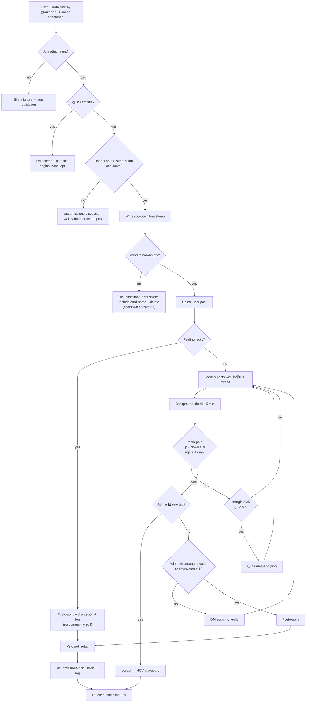
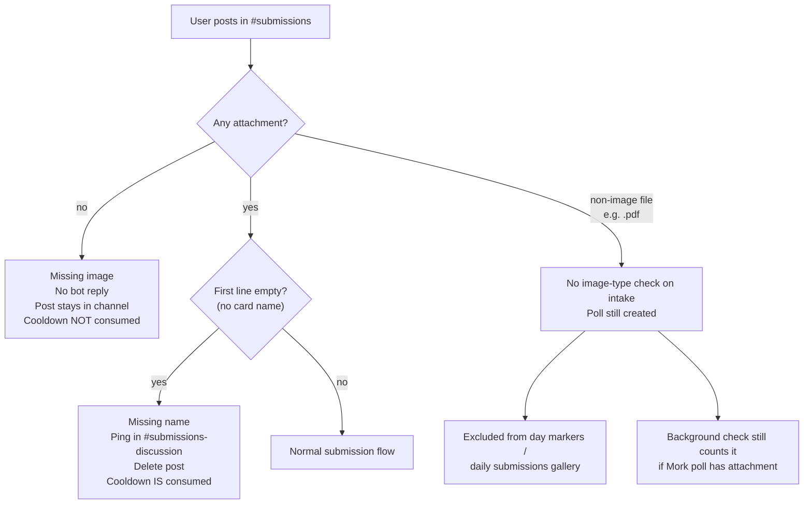
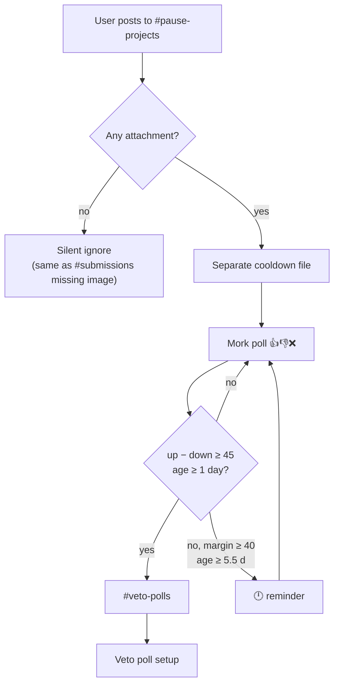
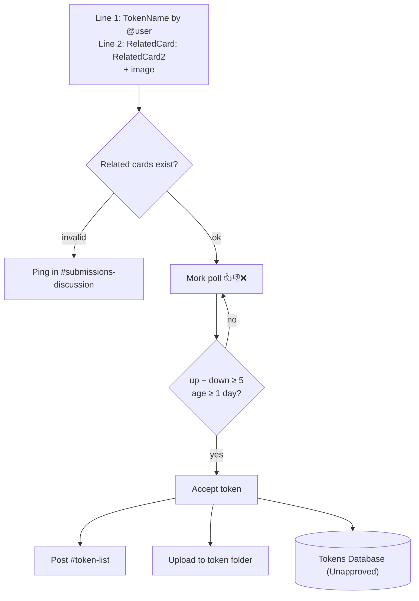
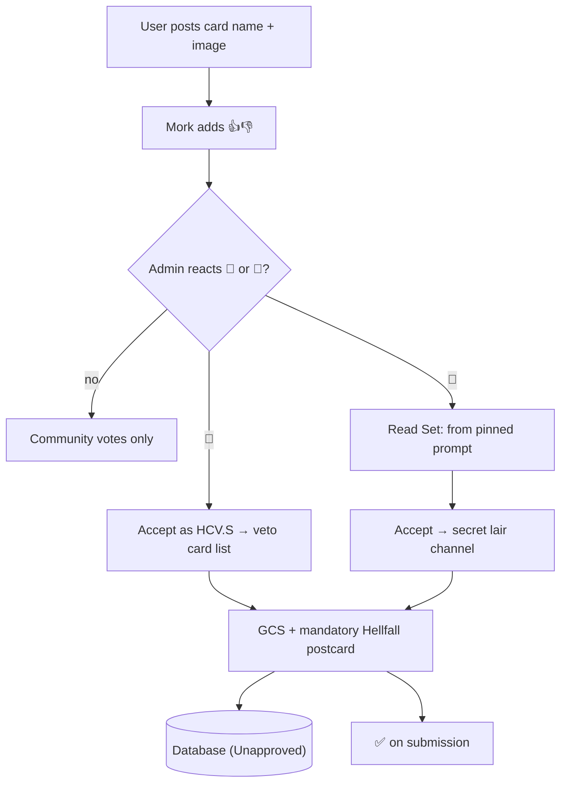
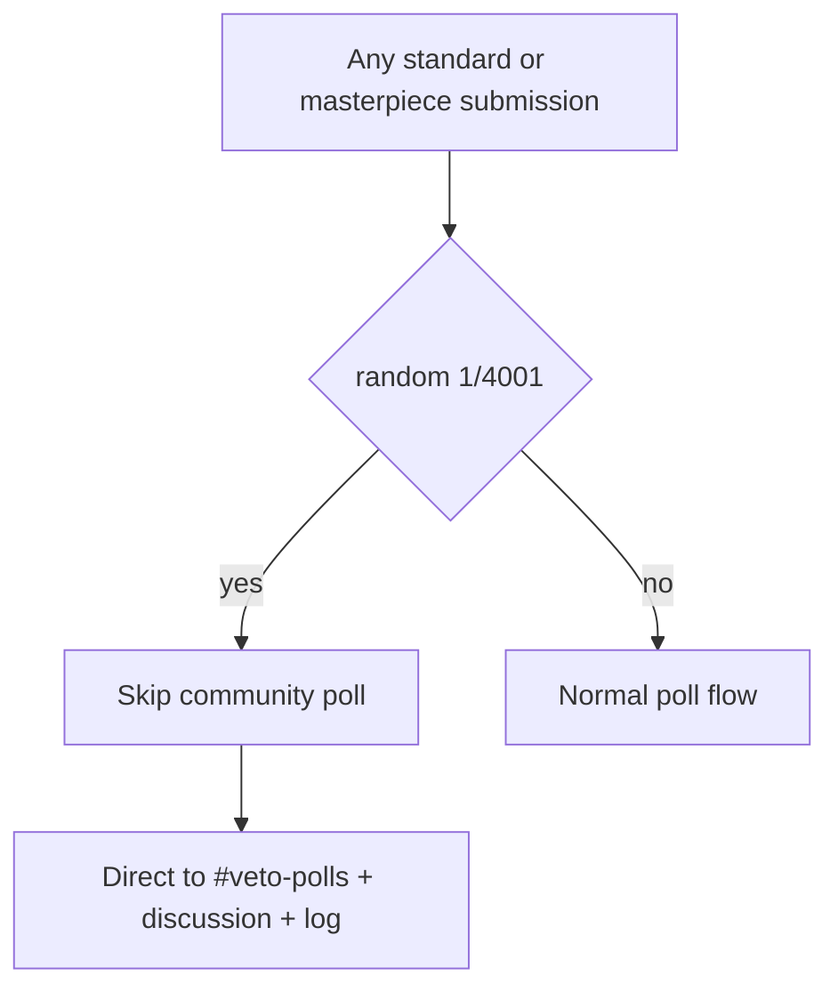

# Submissions

[← Card flows](README.md)

## Standard card submission

**Entry:** `#submissions` · background check every 5 min · `!wait` for cooldown

### Happy path

### Missing / invalid submission cases

| Case                     | Trigger                           | Bot response                                 | User post                  | Cooldown       |
| ------------------------ | --------------------------------- | -------------------------------------------- | -------------------------- | -------------- |
| **Missing image**        | No attachment                     | None (silent ignore)                         | **Kept** in `#submissions` | Not written    |
| **Missing card name**    | Attachment present, empty content | `#submissions-discussion`: include card name | Deleted                    | **Consumed**   |
| **`@` in title**         | `@` in first line                 | DM: no `@` allowed                           | Kept                       | Not written    |
| **On cooldown**          | Submitted within 22 h             | `#submissions-discussion`: wait message      | Deleted                    | Already active |
| **Non-image attachment** | e.g. PDF attached                 | Poll created anyway                          | Deleted (reposted as poll) | Consumed       |
| **Magic skip**           | 1/4001 roll                       | Straight to veto (no poll)                   | Deleted                    | Consumed       |

**Missing image:** Intake bails before cooldown, name checks, or repost. Text-only posts stay in channel with no ping to attach an image.

**Image detection elsewhere:** Day markers and the daily submissions gallery only count messages whose first attachment is an image (`image/*` content type or `.png` / `.jpg` / `.jpeg` / `.gif` / `.webp` / `.bmp`). That filter does not apply at initial `#submissions` intake.

---

## Masterpiece / Pause Projects submission

Same shape as standard submission; different channel, threshold, and cooldown state file.

---

## Token submission

**Entry:** `#token-submissions` · background check every 5 min

---

## Design Hell submission & acceptance

**Entry:** `#design-hell-submissions` · admin 🥇/🥈 reaction

---

## Magic easter egg

The roll range is bumped by 1000 each time it fires.
