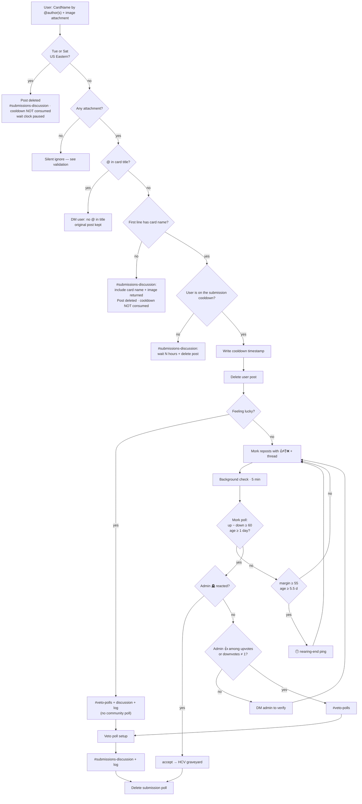
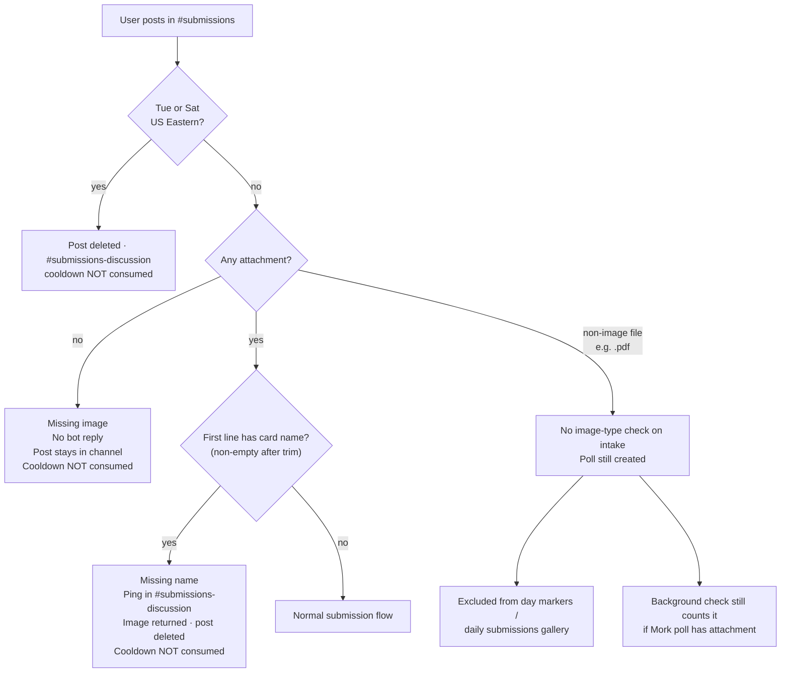
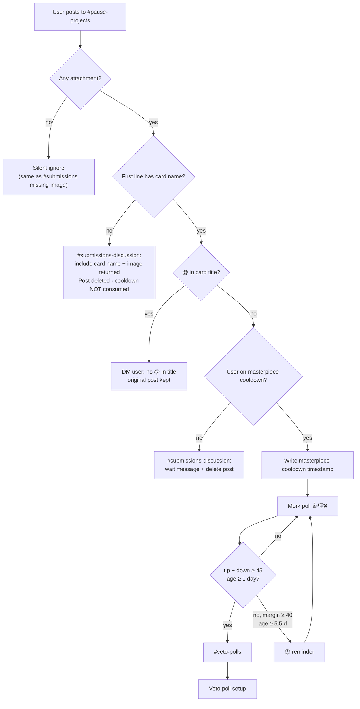
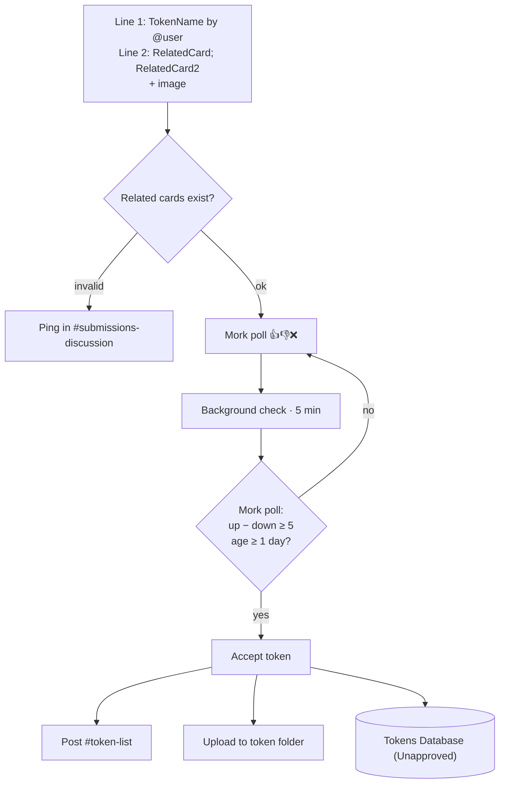
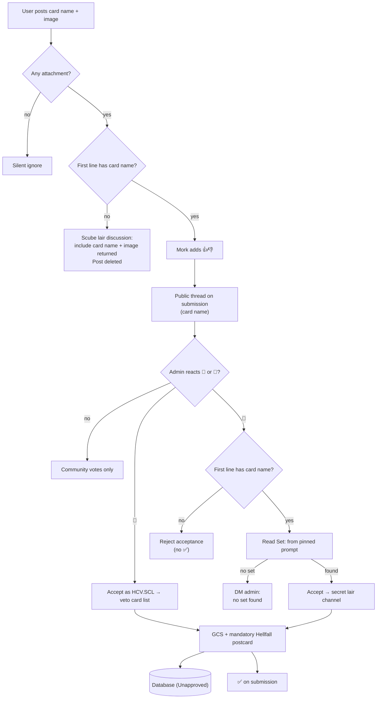
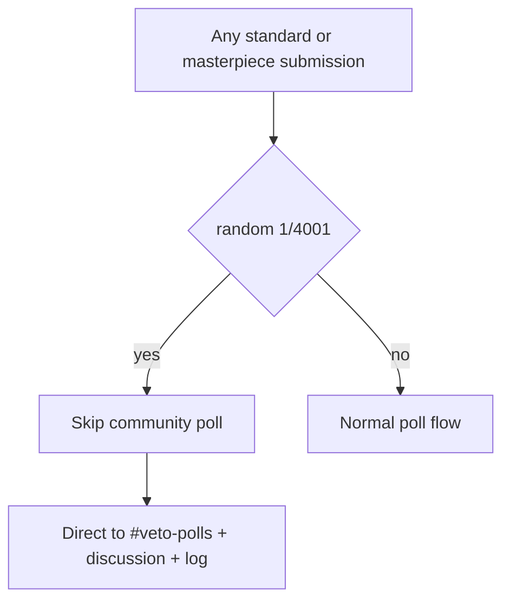

# Submissions

[← Card flows](README.md)

## Standard card submission

**Entry:** `#submissions` · background check every 5 min · `!wait` for cooldown

Closed all day **Tuesday and Saturday** in US Eastern (`America/New_York`, EST/EDT). Those days do not count toward the 22h cooldown. `#pause-projects` and other intake channels stay open.

### Happy path

### Missing / invalid submission cases

| Case                     | Trigger                           | Bot response                                 | User post                  | Cooldown       |
| ------------------------ | --------------------------------- | -------------------------------------------- | -------------------------- | -------------- |
| **Closed day**           | Tuesday or Saturday, US Eastern | `@here` in `#submissions` and `#submissions-discussion`; post deleted | Deleted                    | Not written; clock paused |
| **Missing image**        | No attachment                     | None (silent ignore)                         | **Kept** in `#submissions` | Not written    |
| **Missing card name**    | Attachment present, empty/whitespace first line | `#submissions-discussion`: include card name + image returned | Deleted                    | Not written    |
| **`@` in title**         | `@` in first line                 | DM: no `@` allowed                           | Kept                       | Not written    |
| **On cooldown**          | Submitted within 22 open hours (Tue/Sat Eastern excluded) | `#submissions-discussion`: wait message      | Deleted                    | Already active |
| **Non-image attachment** | e.g. PDF attached                 | Poll created anyway                          | Deleted (reposted as poll) | Consumed       |
| **Magic skip**           | 1/4001 roll                       | Straight to veto (no poll)                   | Deleted                    | Consumed       |

**Closed day:** Checked first. Any user post in `#submissions` on Tuesday or Saturday (US Eastern) is deleted and noted in `#submissions-discussion`. Cooldown timestamps are not written, and elapsed wait time ignores those days. At the start of each closed day Mork posts `@here THE GATES OF HELL ARE CLOSED` in `#submissions` and `#submissions-discussion`; at the start of Wednesday and Sunday (US Eastern) Mork posts `@here THE GATES OF HELL HAVE OPENED` in those channels.

**Missing name:** Intake bails before cooldown write or repost. The card image is reattached in `#submissions-discussion` so the user can fix the title and resubmit. Whitespace-only first lines count as missing.

**Missing image:** Intake bails before cooldown, name checks, or repost. Text-only posts stay in channel with no ping to attach an image. Open days only; closed days delete the post and note the attempt in `#submissions-discussion` instead.

**Image detection elsewhere:** Day markers and the daily submissions gallery only count messages whose first attachment is an image (`image/*` content type or `.png` / `.jpg` / `.jpeg` / `.gif` / `.webp` / `.bmp`). That filter does not apply at initial `#submissions` intake.

---

## Masterpiece / Pause Projects submission

Same intake validation as standard submission (attachment, `@` in title, card name, cooldown); different channel, poll threshold, and cooldown state file. Tuesday/Saturday closures apply only to `#submissions`.

---

## Token submission

**Entry:** `#token-submissions` · background check every 5 min

---

## Scube Lair submission & acceptance

**Entry:** `#scube-lair-submissions` · admin 🥇/🥈 reaction

| Case                  | Trigger                           | Bot response                                 | User post |
| --------------------- | --------------------------------- | -------------------------------------------- | --------- |
| **Missing image**     | No attachment                     | None (silent ignore)                         | Kept      |
| **Valid submission**  | Attachment + card name on first line | 👍👎 + public discussion thread (card name) | Kept      |
| **Missing card name** | Attachment present, empty/whitespace first line | Scube lair discussion channel: include card name + image returned | Deleted   |
| **Missing set (gold)** | Admin 🥇, no pin or unparsable `Set:` on first pin | DM to admin | Kept      |

---

## Magic easter egg

The roll range is bumped by 1000 each time it fires.
