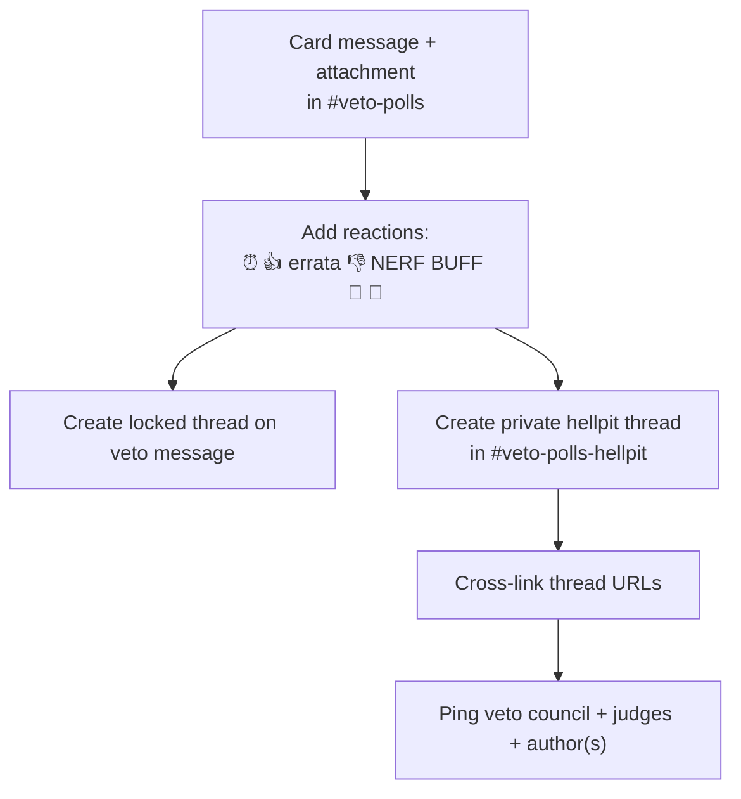
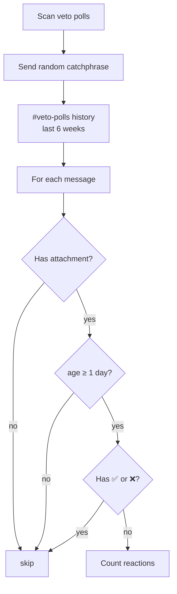
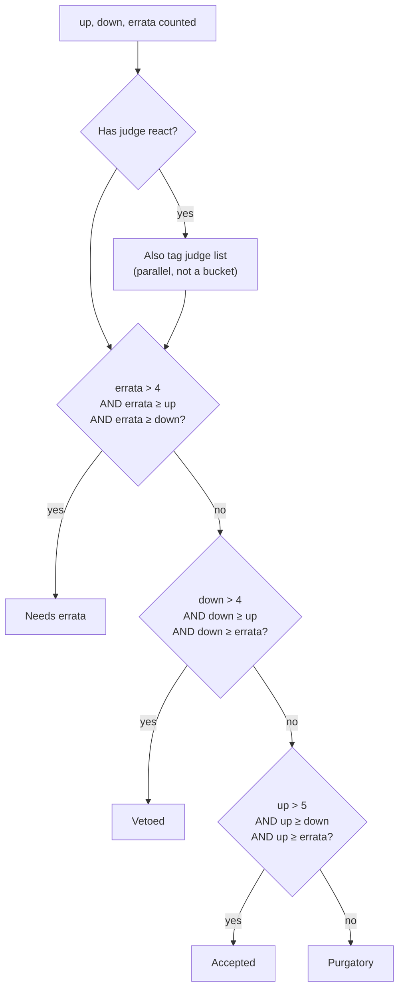
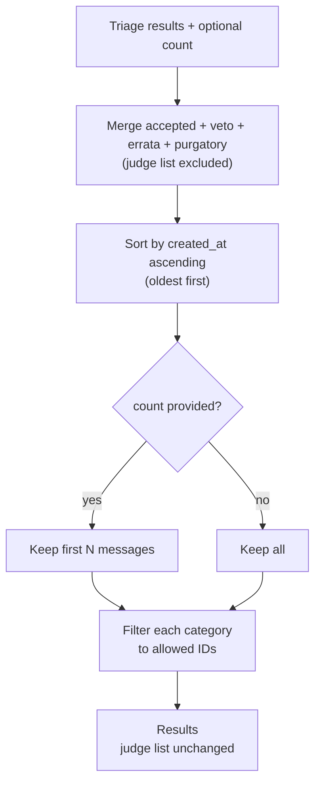
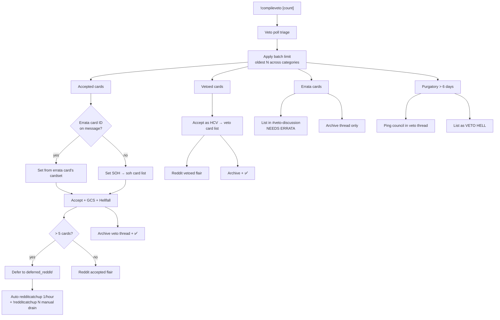
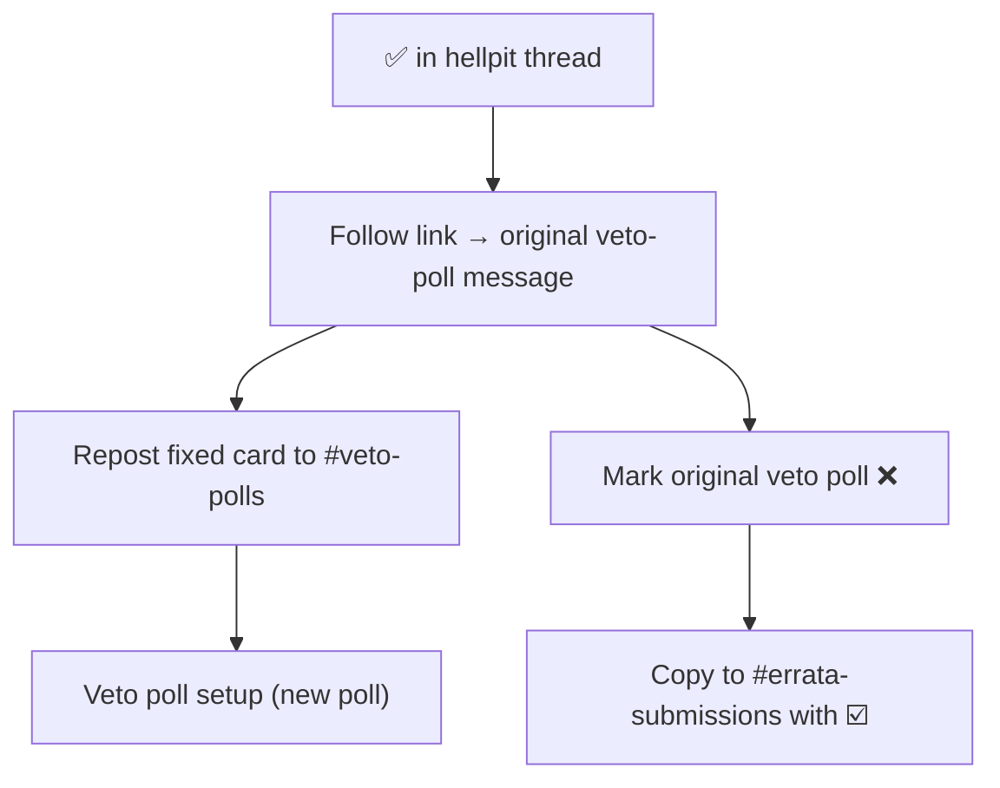

# Veto

[← Card flows](README.md)

## Veto poll setup

**Entry:** Any new message in `#veto-polls` · also called from submission checks, errata flows, hellpit resubmit

---

## Veto poll triage

**Callers:** `!compileveto [count]` (processes results) · `!personalhell` (read-only purgatory list)

### Scan & filter

### Reaction counts

Missing reactions default to **−1** (not 0):

| Vote   | Emoji    | Count           |
| ------ | -------- | --------------- |
| Up     | 👍       | count or **−1** |
| Down   | 👎       | count or **−1** |
| Errata | Spelling | count or **−1** |

### Classification (if / elif chain)

Each eligible message lands in **exactly one** of four outcome buckets. Order matters — first match wins.

**Threshold cheat sheet** (with missing reactions at −1):

| Outcome   | Minimum winning votes | Must also beat  |
| --------- | --------------------- | --------------- |
| Errata    | 5 errata (`> 4`)      | up and down     |
| Vetoed    | 5 down (`> 4`)        | up and errata   |
| Accepted  | 6 up (`> 5`)          | down and errata |
| Purgatory | everything else       | —               |

**Judge react:** Adds a parallel tag in addition to normal classification. `compileveto` and `personalhell` do not read that list — a judge-tagged card can still be accepted, vetoed, errata, or purgatory on the next compile.

### Batch limit (`!compileveto [count]`)

### Worked examples

| 👍  | 👎  | errata | Result        | Why                                    |
| --- | --- | ------ | ------------- | -------------------------------------- |
| 8   | 2   | 1      | **accepted**  | up > 5, up ≥ down, up ≥ errata         |
| 3   | 7   | 2      | **vetoed**    | down > 4, down ≥ up, down ≥ errata     |
| 4   | 4   | 6      | **errata**    | errata > 4, errata ≥ up, errata ≥ down |
| 4   | 3   | 2      | **purgatory** | no category clears its threshold       |
| 6   | 6   | 6      | **purgatory** | ties block all three winners           |
| 2   | 1   | −1     | **purgatory** | up ≤ 5                                 |

---

## Compile veto (batch processing)

**Entry:** `!compileveto` in `#veto-discussion` (veto council only)

## Hellpit resubmit (errata rework)

**Entry:** ✅ on a message in a `#veto-polls-hellpit` thread (admin/veto only)

