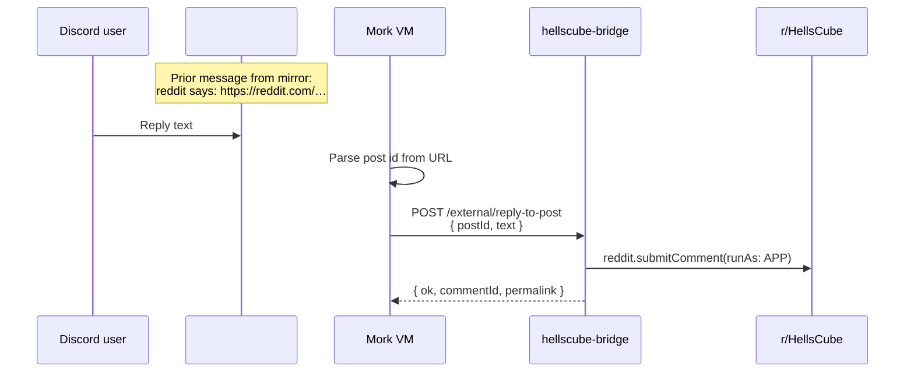

# hellscube-bridge Discord → Reddit replies

Mork forwards human replies in `#reddit` to Reddit comments via Devvit when enabled.

## Flow



## Endpoint

| | |
|---|---|
| **Route** | `POST /external/reply-to-post` |
| **Auth** | Managed App Token (`Authorization: Bearer devvit_at_…`) |
| **Body** | `{ "postId": "abc123", "text": "…" }` — `postId` may include or omit `t3_` |

## Feature flags

| Switch | Where | Effect |
|--------|-------|--------|
| `REDDIT_REPLY_VIA_DEVVIT=1` | VM `.env` | Use Devvit; asyncpraw fallback on failure |
| *(none on Devvit)* | — | Mork chooses transport |

Requires the same `DEVVIT_POST_CARD_URL` + `DEVVIT_POST_CARD_SECRET` as acceptance posts (base URL is rewritten to `/external/reply-to-post`).

## Prefix matching

Triggers when the **prior** mirror message (Mork or mork-bridge webhook) uses either prefix:

- `reddit says:`
- `Reddit thinks Hellscube would love this:`

## Cutover

```bash
REDDIT_REPLY_VIA_DEVVIT=1
```

Keep asyncpraw fallback until Devvit path is verified in production.

## Rollback

```bash
REDDIT_REPLY_VIA_DEVVIT=0
```

Mork resumes `post.reply()` via asyncpraw only.
