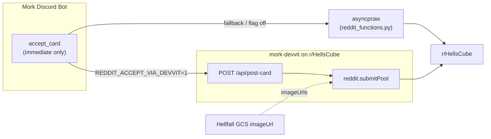
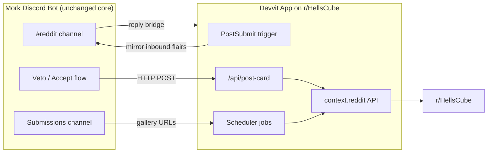

# Reddit → Devvit migration plan

Planning doc captured from the initial Devvit port investigation (Aug 2026). Goal: move Mork’s Reddit layer off asyncpraw/PRAW and onto [Reddit’s Developer Platform (Devvit)](https://developers.reddit.com/docs/introduction/intro-mod-tools), optionally using [HTTP Fetch](https://developers.reddit.com/docs/capabilities/http-fetch) to talk to the existing Mork backend on GCP.

Reddit’s migration guidance assumes a **Devvit app installed on the subreddit**, with fetch to external backends where needed. Discord stays the source of truth for card lifecycle; Reddit becomes a first-class app.

## What Mork does on Reddit today

The Reddit layer is small (~400 lines) and lives inside the Discord bot — not a standalone Reddit app or mod tool.

| Feature | How it works | Files |
|---------|--------------|-------|
| **Acceptance posts** | When veto council accepts/vetoes a card, posts image + title to r/HellsCube | `accept_card.py`, `reddit_devvit.py`, `reddit_functions.py` |
| **Deferred batch queue** | >20 cards in one round → filesystem queue; `!redditcatchup` drains it | `deferred_reddit.py` |
| **Card of the day** | Daily ~10:00 UTC: HC6 card from Google Sheets → image post | `cogs/Lifecycle.py` |
| **Daily gallery** | Daily ~04:00 UTC: random 10 Discord submission images → gallery post | `cogs/lifecycle/post_daily_submissions.py` |
| **Reddit → Discord mirror** | Every 5 min: search r/HellsCube by flair, post links to `#reddit` | `cogs/lifecycle/check_reddit.py` |
| **Discord → Reddit replies** | Reply in `#reddit` to a bot link → asyncpraw `submission.reply()` | `cogs/Lifecycle.py` |

Auth is **script-app password flow** via asyncpraw, duplicated in four files. Everything is hardcoded to `HellsCube`.

See also: [card-flow background](../card-flows/background.md) for cron timing and flair constants.

## Current vs target architecture

### Phase 1 (implemented)

Mork POSTs directly to the Devvit app — no GCP bridge API yet.



### Full target (later phases)



### Recommended split

**Move to Devvit (Reddit-native):**

- Image + gallery posting via `context.reddit` (replaces asyncpraw)
- `PostSubmit` trigger for mirroring — replaces the 5-min flair search poll; fires on new submissions with target flairs
- Scheduler for card-of-the-day and daily gallery
- Dedup state in Devvit KV/Redis instead of scanning Discord history

**Keep in Discord bot:**

- Card lifecycle, veto council, submissions
- On accept: `POST` to GCP API with `{title, imageUrl, flair, setId}` instead of calling asyncpraw directly

**Bridge via HTTP Fetch:**

- `discord.com` is on Devvit’s global allowlist — mirroring to Discord works
- `storage.googleapis.com` is allowlisted — card images from GCS/Drive URLs work
- Google Sheets is **not** allowlisted — card-of-the-day needs a thin GCP endpoint that reads the sheet and returns `{title, imageUrl}`

### Planned Devvit project layout

```
mork-devvit/
  devvit.json          # permissions: http (your-api.run.app, discord.com, storage.googleapis.com)
  src/
    main.ts            # triggers, scheduler, mod menu
    postCard.ts        # submit image/gallery with flair
    mirrorToDiscord.ts # PostSubmit → Discord webhook
    scheduledPosts.ts  # card-of-the-day, daily gallery
  README.md            # Fetch Domains section (required for approval)
```

## Feature-by-feature port effort

| Feature | Devvit approach | Effort |
|---------|-----------------|--------|
| Acceptance posts | Mork → Devvit `/api/post-card` (stage 1) | **Done** — optional via feature flag |
| Deferred queue | Devvit KV queue + mod menu “Post N deferred” | Medium — replaces filesystem + `!redditcatchup` |
| Reddit → Discord mirror | `PostSubmit` trigger + flair filter | **Easy** — better than current polling |
| Discord → Reddit replies | Discord webhook → Devvit → `comment.reply()` | Medium |
| Card of the day | Scheduler + GCP proxy for sheet data | Medium |
| Daily gallery | Scheduler + GCP endpoint listing recent Discord submission URLs | Hard — needs image pipeline outside Discord |

**Rough total:** ~2–4 weeks for the core loop (acceptance posts + mirroring + replies). Gallery + card-of-the-day add another week.

## Migration phases

1. **Scaffold** — `mork-devvit/` Devvit app (done on `reddit-devvit-migration`)
2. **Phase 1 (in progress)** — Devvit `/external/post-card` + Mork feature flag `REDDIT_ACCEPT_VIA_DEVVIT` ([external endpoints](https://developers.reddit.com/docs/capabilities/server/external-endpoints) access pending)
3. **Phase 2** — `PostSubmit` trigger replaces `check_reddit.py` polling
4. **Phase 3** — Mod menu for deferred queue + card-of-the-day scheduler
5. **Launch** — Install on r/HellsCube; Terms/Privacy Policy required for HTTP Fetch; apply for Developer Funds

Phase 1 code lives in `mork-devvit/` and `reddit_devvit.py`. Deploy Devvit via `.github/workflows/devvit-deploy.yml` (manual; needs `DEVVIT_TOKEN` secret). Enable on the VM only after playtest confirms posting works.

## Funding options

### 1. [Reddit Developer Funds 2026](https://support.reddithelp.com/hc/en-us/articles/27958169342996-Reddit-Developer-Funds-2026-Terms)

- Ongoing; pays for **Daily Qualified Engagers** and **Qualified Installs**
- Needs installs in monetizable communities (200+ / 1000+ members)
- Up to 3 apps per developer
- **Fit:** Good if the Devvit app gets real daily use on r/HellsCube. Engagement comes from community interaction, not just bot posting.

### 2. Mod Tools Hackathon (April 29 – May 27, 2026)

- [$45k prizes](https://mod-tools-migration.devpost.com/), including **“Best Ported App”** for PRAW bots ported to Devvit
- Requires bot operating before March 2026 with 500+ WAU community
- **Fit:** Mork’s Reddit bot may qualify as a port, but the hackathon window has closed. The **App Migration Program / porting bounty** mentioned on that page may still apply — worth asking in [r/devvit](https://reddit.com/r/devvit).

### 3. Positioning

Mork’s Reddit code is a **community content bridge**, not a mod tool (no queues, automod, bans, etc.). Devvit’s marketing emphasizes [mod tools](https://developers.reddit.com/docs/introduction/intro-mod-tools), but the hackathon also accepted “utilities that improve day-to-day functioning.”

To maximize funding odds, consider reframing or extending:

- **“HellsCube Bridge”** — official cross-posting between Discord and Reddit (what we have now)
- **“Submission Tracker” mod tool** — mod dashboard showing Discord submission status for Reddit posts with target flairs
- **“Card Announcement Bot”** — mod-configurable scheduled community posts

Adding a small mod-facing config UI (flair filters, post schedule, deferred queue dashboard) makes it a clearer Devvit mod tool without changing core behavior.

## Why port (beyond funding)

1. **Auth durability** — script password auth is fragile; Reddit is tightening Data API access. Devvit runs natively with platform auth.
2. **Gallery hack goes away** — `post_gallery_to_reddit` uses private asyncpraw internals with a 7.7→7.8 shim.
3. **Cleaner architecture** — four duplicate Reddit client setups → one Devvit app.
4. **Mod installability** — other cube subreddits could install a generalized version.

## Related in-repo work

Before or alongside the Devvit port, clean up the existing Reddit layer:

- Branch `fix/reddit-set-id` — set ID in Reddit titles, JSON deferred manifest, Unicode-safe filenames
- `TODO.md` — “The regular reddit posting code is gross. fix it”

## References

- [Mod Tools on Reddit (Devvit intro)](https://developers.reddit.com/docs/introduction/intro-mod-tools)
- [HTTP Fetch](https://developers.reddit.com/docs/capabilities/http-fetch)
- [Automation & Triggers](https://developers.reddit.com/docs/capabilities/automation-and-triggers)
- [Post Creation & Navigation](https://developers.reddit.com/docs/capabilities/post-creation-and-navigation)
- [Reddit API (Devvit)](https://developers.reddit.com/docs/capabilities/reddit-api)
- [Mod Tools Quickstart](https://developers.reddit.com/docs/build-mod-tools/quickstart)
- [Reddit Data API setup (current auth)](https://support.reddithelp.com/hc/en-us/articles/16160319875092-Reddit-Data-API-Wiki)

## Status

See **[CHECKLIST.md](CHECKLIST.md)** for the living cutover tracker (platform, prod flags, next steps).

Summary (2026-08-29): app **installed** on r/HellsCube; **COTD live** on Devvit; **external endpoints pending** (acceptance + reply still on asyncpraw); mirror ready to flip without external endpoints.
